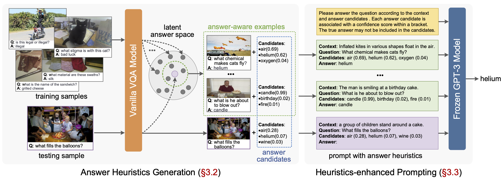

# Prophet

[](https://paperswithcode.com/sota/visual-question-answering-on-a-okvqa?p=prompting-large-language-models-with-answer)
[](https://paperswithcode.com/sota/visual-question-answering-on-ok-vqa?p=prompting-large-language-models-with-answer)

This repository is the official implementation of the Prophet, a two stage framework designed to prompt GPT-3 with answer heuristics for knowledge-based VQA. In stage one, we train a vanilla VQA model on a specific knowledge-based VQA dataset and extract two types of complementary answer heuristics from the model: answer candidates and answer-aware examples. In stage two, answer heuristics are used to prompt GPT-3 to generate better answers. Prophet significantly outperforms existing state-of-the-art methods  on two datasets, delivering 61.1% on OK-VQA and 55.7% on A-OKVQA. Please refer to our [paper](https://arxiv.org/pdf/2303.01903.pdf) for details.



## Updates
April 28, 2023
- Add pretrained and finetuned models on A-OKVOA.

March 10, 2023
- Training and testing codes of the two-stages Prophet framework.
- Pretrained and finetuned models on OK-VOA.

## Table of Contents

- [Prerequisites](#prerequisites)
- [Usage](#usage)
- [Evaluation](#evaluation)
- [Citation](#citation)
- [License](#license)
<!-- - [Acknowledgement](#acknowledgement) -->

## Prerequisites

### Hardware and Software Requirements

To conduct the following experiments, a machine with at least 1 RTX 3090 GPU, 50GB memory, and 300GB free disk space is recommended. We strongly recommend using an SSD drive to guarantee high-speed I/O.

Following software is needed:

1. [Python](https://www.python.org/downloads/) >= 3.9
2. [Cuda](https://developer.nvidia.com/cuda-toolkit) >= 11.3
3. [Pytorch](https://pytorch.org/get-started/locally/) >= 12.0
5. what you can find in [environment.yml](environment.yml)

We recommend downloading [Anaconda](https://www.anaconda.com/) first and then creating a new environment with the following command:

``` shell
$ conda env create -f environment.yml
```

This command will create a new environment named `prophet` with all the required packages. To activate the environment, run:

``` shell
$ conda activate prophet
```

### Data Preparation

Before running the code, prepare two folders: `datasets` and `assets`. The `datasets` folder contains all the datasets and features used in this project, and the `assets` folder contains the pre-computed resources and other intermediate files (you can use them to skip some early experiment steps and save time).

First, download the [datasets](https://awma1-my.sharepoint.com/:u:/g/personal/yuz_l0_tn/Ebzd7EANzHVHnh3FvYvCJ7kBkJf56iT1Obe5L2PZAzgM2g?download=1) and [assets](https://awma1-my.sharepoint.com/:u:/g/personal/yuz_l0_tn/Ec5NPIswAxlEqi74qwGjIf0BKInF0O6nwW5dtn4h3GOUsQ?download=1). Then put the `datasets` and `assets` folder in the root directory of this project. Download MSCOCO 2014 and 2017 images from [here](https://cocodataset.org/#download) (you can skip MSCOCO 2017 if you only experiments on OK-VQA) and put them in the `datasets` folder. Run the following command to extract the features of the images:

``` shell
$ bash scripts/extract_img_feats.sh
```

After that, the `datasets` and `assets` folder will have the following structure:

<details>
<summary>Click to expand</summary>

```
datasets
├── aokvqa
│   ├── aokvqa_v1p0_test.json
│   ├── aokvqa_v1p0_train.json
│   └── aokvqa_v1p0_val.json
├── coco2014
│   ├── train2014
│   └── val2014
├── coco2014_feats
│   ├── train2014
│   └── val2014
├── coco2017
│   ├── test2017
│   ├── train2017
│   └── val2017
├── coco2017_feats
│   ├── test2017
│   ├── train2017
│   └── val2017
├── okvqa
│   ├── mscoco_train2014_annotations.json
│   ├── mscoco_val2014_annotations.json
│   ├── OpenEnded_mscoco_train2014_questions.json
│   └── OpenEnded_mscoco_val2014_questions.json
└── vqav2
    ├── v2_mscoco_train2014_annotations.json
    ├── v2_mscoco_val2014_annotations.json
    ├── v2_OpenEnded_mscoco_train2014_questions.json
    ├── v2_OpenEnded_mscoco_val2014_questions.json
    ├── v2valvg_no_ok_annotations.json
    ├── v2valvg_no_ok_questions.json
    ├── vg_annotations.json
    └── vg_questions.json
```
</details>

We've also provided a tree structure of the entire project in [misc/tree.txt](misc/tree.txt).

## Usage

We provide bash scripts for each stage of the Prophet framework. You can find them in the `scripts` directory. There are two common arguments you should take care of when running each script:

- `--task`: specify the task (i.e., the target dataset) you want to deal with. The available options are `ok` (training on `train` set of OK-VQA and evaluating on the `test` set of OK-VQA), `aok_val` (training on `train` set of A-OKVQA and evaluating on the `val` set of A-OKVQA) and `aok_test` (training on `train` set and `val` set of A-OKVQA and evaluating on the `test` set of A-OKVQA);

Note that although Prophet uses VQA v2 datasets for pre-training, there are slight differences in how the datasets are used for different tasks (`ok`, `aok_val`, and `aok_test`), as detailed in [configs/task_to_split.py](configs/task_to_split.py). This means that different pre-training commands need to be followed for each task.

- `--version`: specify the version name of this run. This name will be used to create a new folder in the `outputs` directory to store the results of this run.

Notice that you can omit any arguments when invoking following scripts, it will then use the default arguments written in the script files.

Before running any script, you can also update the configuration files (`*.yml`) in the `configs` directory to change hyperparameters.

### 1. OK-VQA

Take OK-VQA for example, Propht consists of two phases, stage one  for training a vanilla VQA model and extracting answer heuristics, and stage two for prompting GPT-3 with answer heuristics.

#### **Stage one**

At this stage, we train an improved MCAN model (check the [paper](https://arxiv.org/pdf/2303.01903.pdf) for detail description) through pretraning on VQA v2 and finetuning on target dataset. Multiple GPUs are supported by setting `--gpu 0,1,2,3` (for example). Run pretraining step with commands:

```shell
$ bash scripts/pretrain.sh \
    --task ok --version okvqa_pretrain_1 --gpu 0
```
We've provided a pretrained model for OK-VQA [here](https://awma1-my.sharepoint.com/:u:/g/personal/yuz_l0_tn/EcdTatraOqRJnZXBDXfr7QQBPtn8QYCa2m3Pvq0LlEml9Q?download=1). Then, run finetuning step with commands:

```shell
$ bash scripts/finetune.sh \
    --task ok --version okvqa_finetune_1 --gpu 0 \
    --pretrained_model outputs/okvqa_pretrain_1/ckpts/epoch_13.pkl
```

All epoch checkpoints are saved in `outputs/ckpts/{your_version_name}`. We've also provided a finetuned model for OK-VQA [here](https://awma1-my.sharepoint.com/:u:/g/personal/yuz_l0_tn/ESUb093PgyZFtLnU_RIYJQsBN_PU0jJdu-eFUb1-4T4mIQ?download=1). You may pick one to generate answer heuristics by run following command:

```shell
$ bash scripts/heuristics_gen.sh \
    --task ok --version okvqa_heuristics_1
    --gpu 0 --ckpt_path outputs/okvqa_finetune_1/ckpts/epoch_6.pkl
    --candidate_num 10 --example_num 100
```

The extracted answer heuristics will be stored as `candidates.json` and `examples.json` in `outputs/results/{your_version_name}` directory.

#### **Stage two**

You may need the `candidates.json` and `examples.json` files generated in the former stage to step into this stage. **Or you can just skip stage one, and use the files of answer heuristics we provided in `assets`. Especially, the `candidates.json` and `examples.json` files for OK-VQA are `answer_aware_examples_okvqa.json` and `candidates_okvqa.json`.** To prompt GPT-3 with answer heuristics and generate better answers, run the following command:

```shell
$ bash scripts/prompt.sh \
    --task ok --version okvqa_prompt_1 \
    --examples_path outputs/results/okvqa_heuristics_1/examples.json \ 
    --candidates_path outputs/results/okvqa_heuristics_1/candidates.json \
    --openai_key sk-xxxxxxxxxxxxxxxxxxxxxx
```
The result file will be stored as `result.json` in `outputs/results/{your_version_name}` directory.


We also provide example scripts for the `aok_val` and `aok_test` modes on A-OKVQA.
<details>
<summary>Click to expand</summary>

### 2. A-OKVQA (val)

#### **Stage one**
Similary, for task of `aok_val`, run pretraining step with commands:

```shell
$ bash scripts/pretrain.sh \
    --task aok_val --version aokvqa_val_pretrain_1 --gpu 0
```
We've provided a pretrained model for `aok_val` [here](https://awma1-my.sharepoint.com/:u:/g/personal/yuz_l0_tn/EYeIgGR521pNsEjxliqRkmEBGpcwS5p-qrMGTC9ro_SF6g?download=1).Then, run finetuning step with commands:

```shell
$ bash scripts/finetune.sh \
    --task aok_val --version aokvqa_val_finetune_1 --gpu 0 \
    --pretrained_model outputs/aokvqa_val_pretrain_1/ckpts/epoch_13.pkl
```

All epoch checkpoints are saved in `outputs/ckpts/{your_version_name}`.We've also provided a finetuned model for `aok_val` [here](https://awma1-my.sharepoint.com/:u:/g/personal/yuz_l0_tn/EQXIIjAIiJJFrOpobVhyH9oBBeBAY-VttHqfS91qPOKlJw?download=1). You may pick one to generate answer heuristics by run following command:

```shell
$ bash scripts/heuristics_gen.sh \
    --task aok_val --version aokvqa_val_heuristics_1
    --gpu 0 --ckpt_path outputs/aokvqa_val_finetune_1/ckpts/epoch_6.pkl
    --candidate_num 10 --example_num 100
```

The extracted answer heuristics will be stored as `candidates.json` and `examples.json` in `outputs/results/{your_version_name}` directory.

#### **Stage two**

You may need the `candidates.json` and `examples.json` files generated in the former stage to step into this stage. **Or you can just skip stage one, and use the files of answer heuristics we provided in `assets`. Especially, the `candidates.json` and `examples.json` files for `aok_val` are `examples_aokvqa_val.json` and `candidates_aokvqa_val.json`.** To prompt GPT-3 with answer heuristics and generate better answers, run the following command:

```shell
$ bash scripts/prompt.sh \
    --task ok --version okvqa_val_prompt_1 \
    --examples_path outputs/results/aokvqa_val_heuristics_1/examples.json \ 
    --candidates_path outputs/results/aokvqa_val_heuristics_1/candidates.json \
    --captions_path assets/captions_aokvqa.json \
    --openai_key sk-xxxxxxxxxxxxxxxxxxxxxx
```
The result file will be stored as `result.json` in `outputs/results/{your_version_name}` directory.


### 3. A-OKVQA (test)

For task of `aok_val`, run pretraining step with commands:
#### **Stage one**
```shell
$ bash scripts/pretrain.sh \
    --task aok_test --version aokvqa_test_pretrain_1 --gpu 0
```
We've provided a pretrained model for `aok_test` [here](https://awma1-my.sharepoint.com/:u:/g/personal/yuz_l0_tn/EWSBB1OrjIlBoPdTMso6RFABNQKYKBWo1iU4l0w2NVDvuQ?download=1). Then, run finetuning step with commands:

```shell
$ bash scripts/finetune.sh \
    --task aok_test --version aokvqa_test_finetune_1 --gpu 0 \
    --pretrained_model outputs/aokvqa_test_pretrain_1/ckpts/epoch_13.pkl
```

All epoch checkpoints are saved in `outputs/ckptss/{your_version_name}`.We've also provided a finetuned model for `aok_test` [here](https://awma1-my.sharepoint.com/:u:/g/personal/yuz_l0_tn/EQ6gvWbv9VhHrhh0D08G79kBk6JEA_eqXEt5ULgueCf1tA?download=1). You may pick one to generate answer heuristics by run following command:

```shell
$ bash scripts/heuristics_gen.sh \
    --task aok_test --version aokvqa_test_heuristics_1
    --gpu 0 --ckpt_path outputs/aokvqa_test_finetune_1/ckpts/epoch_6.pkl
    --candidate_num 10 --example_num 100
```

The extracted answer heuristics will be stored as `candidates.json` and `examples.json` in `outputs/results/{your_version_name}` directory.

#### **Stage two**

You may need the `candidates.json` and `examples.json` files generated in the former stage to step into this stage. **Or you can just skip stage one, and use the files of answer heuristics we provided in `assets`. Especially, the `candidates.json` and `examples.json` files for `aok_test` are `examples_aokvqa_test.json` and `candidates_aokvqa_test.json`.** To prompt GPT-3 with answer heuristics and generate better answers, run the following command:

```shell
$ bash scripts/prompt.sh \
    --task ok --version okvqa_test_prompt_1 \
    --examples_path outputs/results/aokvqa_test_heuristics_1/examples.json \ 
    --candidates_path outputs/results/aokvqa_test_heuristics_1/candidates.json \
    --captions_path assets/captions_aokvqa.json \
    --openai_key sk-xxxxxxxxxxxxxxxxxxxxxx
```
The result file will be stored as `result.json` in `outputs/results/{your_version_name}` directory.

</details>

## Evaluation

For the task of `ok` and `aok_val` whose annotations are available, the scores are automatically computed after finetuning and prompting. You can also evaluate the result files that outputted after finetuning or prompting, by run

```shell
$ bash scripts/evaluate_file.sh \
    --task ok --result_path outputs/results/okvqa_prompt_1/result.json
```

Using the corresponding result files and evaluation script above, we obtain the accuracies in the following table, respectively.


<table border="2">
<tr><th> OK-VQA</th><th> A-OKVQA (val) </th><th> A-OKVQA (test) </th></tr>
<tr><td>

| MCAN | Prophet |
|:--:|:--:|
| [53.0%](https://awma1-my.sharepoint.com/:u:/g/personal/yuz_l0_tn/EVPAUDjTWX9Gn3GIqj7JwUoB5HMWwL3SRnNf18dSckJBOw?download=1) | [61.1%](https://awma1-my.sharepoint.com/:u:/g/personal/yuz_l0_tn/EUqH0N4fLVdPsLYJ48Wl_gsBneZzyGR23Tv5P9RskOBwNQ?download=1) |
</td><td>

| MCAN | Prophet |
|:--:|:--:|
| [52.0%](https://awma1-my.sharepoint.com/:u:/g/personal/yuz_l0_tn/EdBYZeS55iFEjdlOhUbyWRsBtYnQ3-zerho13mYj2YQ0Ag?download=1) |[58.2%](https://awma1-my.sharepoint.com/:u:/g/personal/yuz_l0_tn/EXDUxT3_LrpDugZ7xj-0BMYBynuFDJQS88M3EGeFEhU5dg?download=1) |
</td><td>

| MCAN | Prophet |
|:--:|:--:|
| 45.6% | 55.7% |
</td></tr>
</table>

For the task of `aok_test`, you need to submit the result file to the [A-OKVQA Leaderboard](https://leaderboard.allenai.org/a-okvqa/submissions/public) to evaluate the result.


## Citation

If you use this code in your research, please cite our paper:

```BibTex
@inproceedings{shao2023prompting,
  title={Prompting Large Language Models with Answer Heuristics for Knowledge-based Visual Question Answering},
  author={Shao, Zhenwei and Yu, Zhou and Wang, Meng and Yu, Jun},
  booktitle={Computer Vision and Pattern Recognition (CVPR)},
  pages={14974--14983},
  year={2023}
}
```

## License

This project is licensed under the Apache License 2.0 - see the [LICENSE](LICENSE) file for details.
